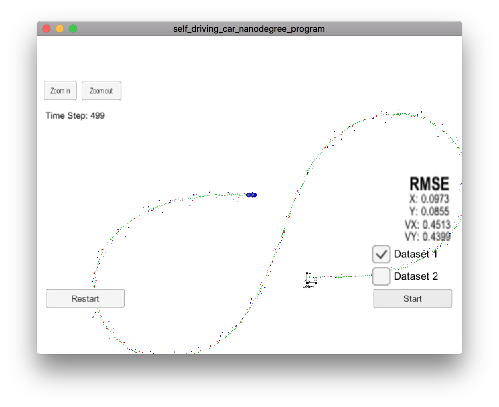
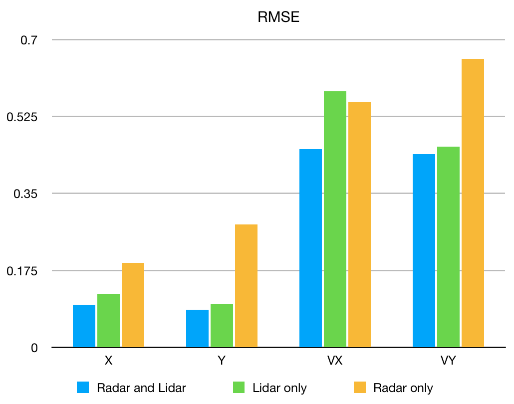

# Extended Kalman Filter Project
Self-Driving Car Engineer Nanodegree Program

This project utilizes a Kalman filter to estimate the state of a moving object of interest with noisy lidar and radar measurements. 

## Project structure

Project structure has been changed compared to the starter code.

`kalman_filter.*` files have been decomposed into `state.*`, `lidar.*` and `radar.*` to handle process state, laser updates and radar updates respectively.

CMakeLists.txt has been changed to include new files.

[main.cpp](src/main.cpp) has two new boolean constants `kUseRadar` and `kUseLidar` which can be set to `false` to "turn off" either radar or lidar sensor. Lines 97-106 of the file implement appropriate checks.

[tools.cpp](src/tools.cpp) implements `CalculateRMSE` and `CalculateJacobian`. The first function `CalculateRMSE` performs sanity checks for empty input (line 13) and equal length of estimations and ground truth vectors (line 17). `CalculateJacobian` checks if state is at the zero point. Both functions throw `std::runtime_error` if validation fails.

[FusionEKF.h](src/FusionEKF.h) has member variables for `ekf::State`, `ekf::Radar` and `ekf::Lidar` (lines 35-37). New functions have been introduced: `InitializeEKF`, `GetInitialP` and `GetState`.

[FusionEKF.cpp](src/FusionEKF.cpp) initializes `state_`, `radar_` and `lidar_` members (line 17). `state_` is initialized with pre-defined constant values for `NOISE_AX`, `NOISE_AY` and initial value of `P_` provided by `GetInitialP` function. Function `Initialize` (line 32) initializes the state. Based on sensor type, different code is executed. For radar measurement, coordinates are computed from polar to cartesian. For laser measurement, coordinates are used as is. `ProcessMeasurement` function calls `Initialize` for the first measurement. For subsequent measurements, it performs Kalman filter steps to predict the state by calling `state_.Predict` (line 71) and update: `radar_.Update` is called for radar measurement (line 79), `lidar_.Update` is called for laser measurement (line 82).

[state.h](src/state.h) contains member variables for state vector `x_` (line 11) and state covariance matrix `P_` (line 14). Additionally, it holds values for process noise `noise_ax_` and `noise_ay_` (lines 40-41), state transition matrix `F_` (line 44) and process covariance matrix `Q_` (line 47).

[state.cpp](src/state.cpp) initializes member variables in constructor (lines 8-27). Function `Predict` (lines 33-43) performs Kalman filter predict step. Function `ComputeQ` computes process covariance matrix Q using time distance from previous measurement `delta_T`.

[radar.h](src/radar.h) contains member variables for measurement covariance matrix `R_` (line 27) and identity matix `I_` (line 28). Additionally, it holds references `state_` (line 26) and value of `pi_` (line 29).

[radar.cpp](src/radar.cpp) initializes values in constructor (lines 10-16). Function `PolarToCartesian` (lines 18-29) performs conversion of radar measurement from polar coordinates to cartesian coordinates. Functions `h` (lines 31-46) implements measurement function for radar sensor. Function `Update` (lines 48-76) performs Kalman filter update step for radar. The first step performed by the function is the check if current state is at point `(0, 0)` (lines 51-54). If state is at zero, Jacobian matrix cannot be computed and measured values is assigned to state. Otherwise full update step is performed.

[lidar.h](src/lidar.h) contains member variables for identity matrix `I_`, measurement matrix `H_`, transposed measurement matrix `Ht_` and measurement covariance matrix `R_` (lines 21-24). It also holds reference `state_` (line 20). Storing a value of transposed matrix `Ht_` allows to avoid computing it every time an update is performed.

[lidar.cpp](src/lidar.cpp) initializes member variables in constructor (lines 8-20). Function `Update` (lines 22-32) performs Kalman filter update step for laser measurements.

## Process visualization

Process visualization provided by the simulator shows expected results: estimated track (green dots) is averaged from radar and lidar measurements (blue and red dots).

## Tracking Accuracy

| Sensors         | X RMSE | Y RMSE | VX RMSE | VY RMSE |
|:---------------:|:------:|:------:|:-------:|:-------:|
| Radar and Lidar | 0.0973 | 0.0855 | 0.4513  | 0.4399  |
| Lidar only      | 0.1222 | 0.0984 | 0.5825  | 0.4567  |
| Radar only      | 0.1918 | 0.2798 | 0.5575  | 0.6567  |

The observed accuracy results match expectations based on accuracy of sensors and the algorithm of Kalman filter. Radar only measurements has the highest RMSE (i.e. the lowest accuracy). Laser only measurements provide lower RMSE (i.e. higher accuracy) than radar only measurements. Fusing both radar and lidar measurements with the help of Kalman filters allows to achieve higher accuracy than what can be achieved by using any of the sensors alone.

These observations confirm that sensor fusion with the help of Kalman filter is a powerful technique to improve accuracy of objects tracking.